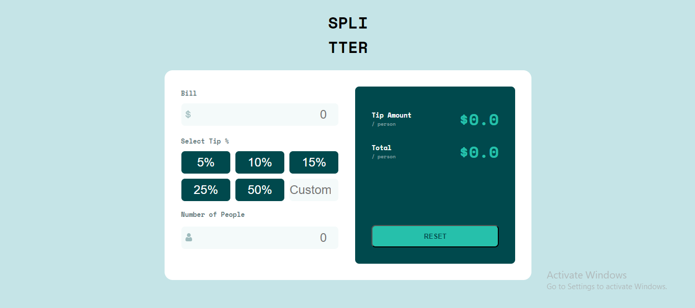
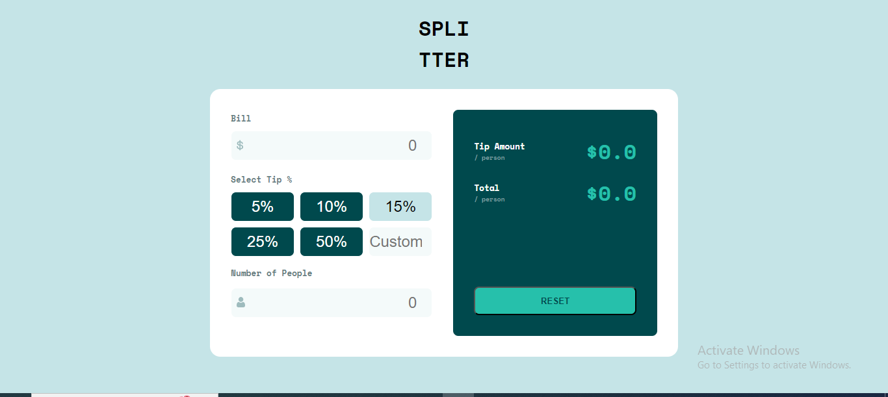
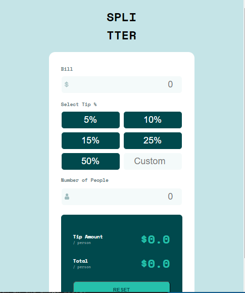

# Frontend Mentor - Tip calculator app solution

This is a solution to the [Tip calculator app challenge on Frontend Mentor](https://www.frontendmentor.io/challenges/tip-calculator-app-ugJNGbJUX).

## Table of contents

- [Overview](#overview)
  - [The challenge](#the-challenge)
  - [Screenshot](#screenshot)
  - [Links](#links)
- [My process](#my-process)
  - [Built with](#built-with)
  - [What I learned](#what-i-learned)
- [Author](#author)

## Overview

### The challenge

Users should be able to:

- View the optimal layout for the app depending on their device's screen size
- See hover states for all interactive elements on the page
- Calculate the correct tip and total cost of the bill per person

### Screenshot

### Links

- GitHub Repo URL: [GitHub Repo URL](https://github.com/KrishnaPoddar1/TipCalculator.git)
- Live Site URL: [Live site URL](https://krishnapoddar1.github.io/TipCalculator/)

## My process

### Built with

- Semantic HTML5 markup
- CSS custom properties
- Flexbox
- CSS Grid
- Mobile-first workflow
- JavaScript 
- Visual Studio Code

### What I learned

Used Form in conjenction with Javascript for the first time.

## Author

- Frontend Mentor - [@KrishnaPoddar1](https://www.frontendmentor.io/profile/KrishnaPoddar1)
